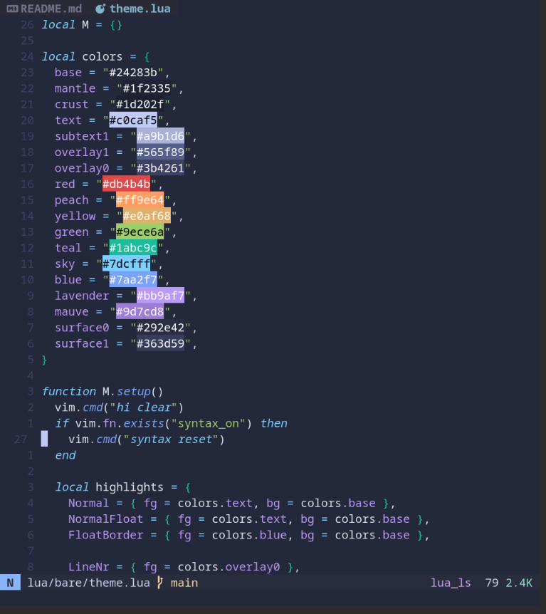
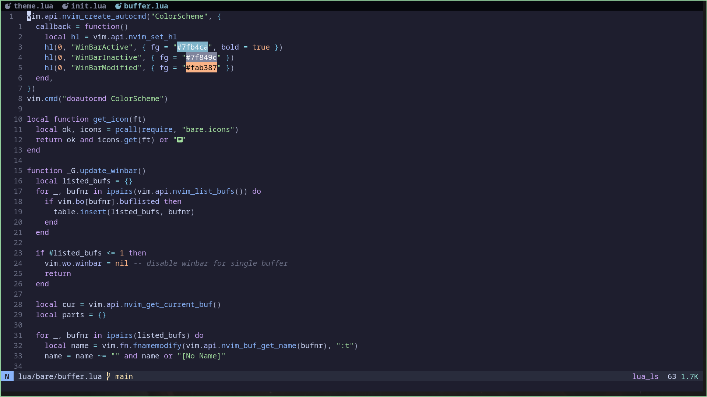
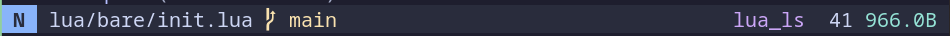
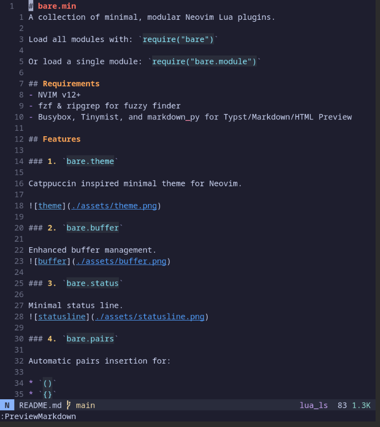
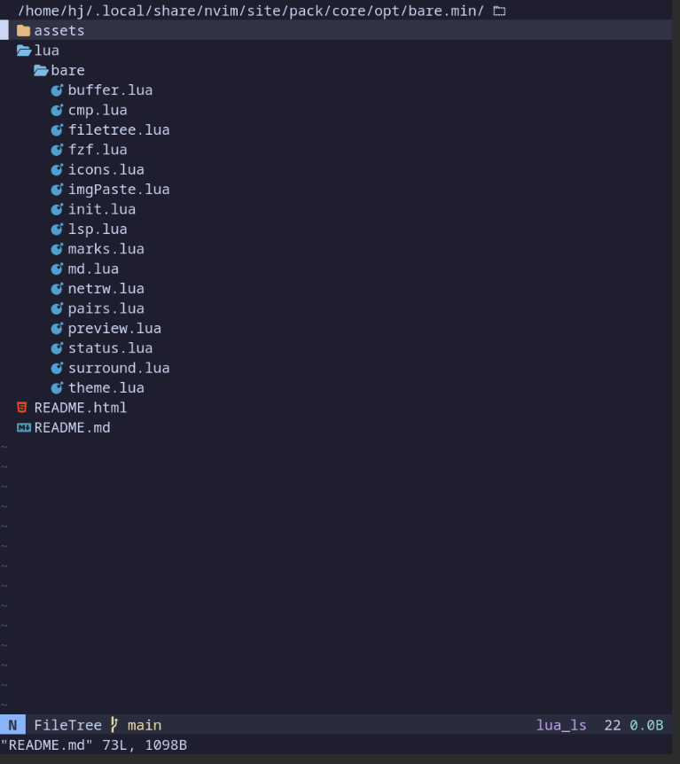
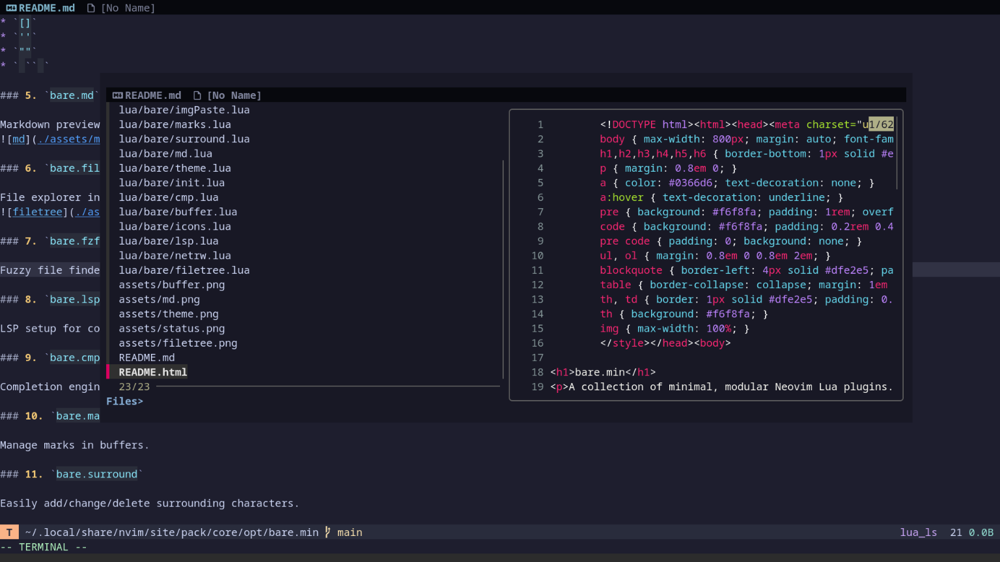
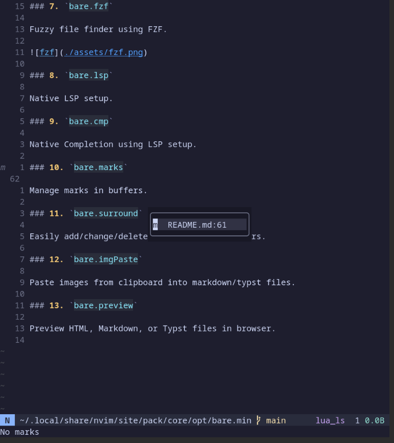
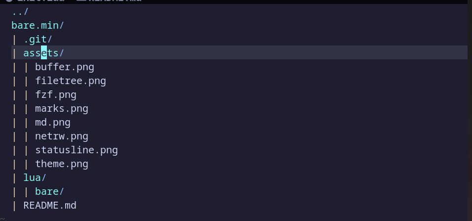
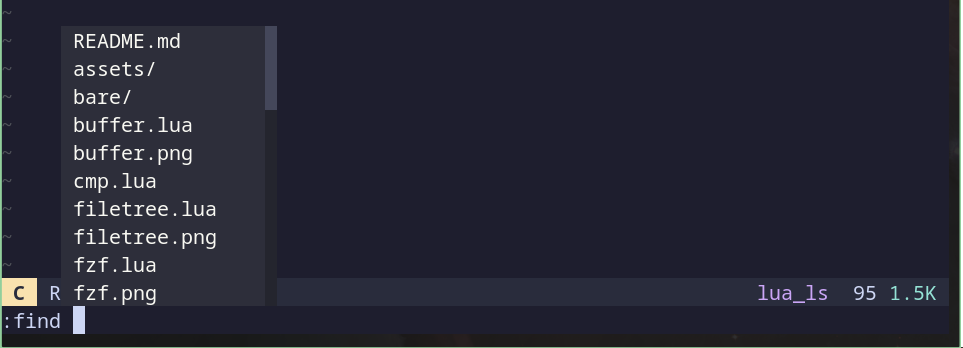
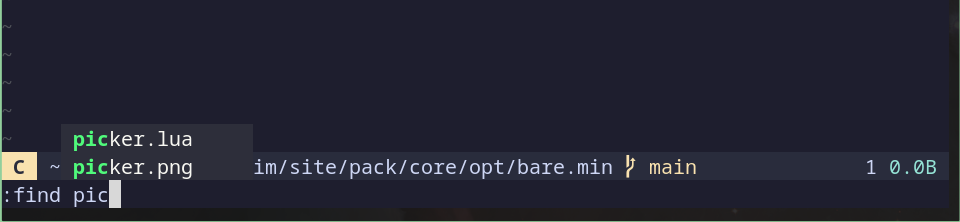

# bare.min
A collection of minimal, modular Neovim Lua plugins.

Load all modules with: `require("bare")`

Or load a single module: `require("bare.module")`

## Requirements
- NVIM v12+
- fzf & ripgrep for fuzzy finder
- Busybox, Tinymist, and grip for Typst/Markdown/HTML Preview

## Features

### 1. `bare.theme`

Catppuccin inspired minimal theme for Neovim.

### 2. `bare.buffer`

Enhanced buffer management.

### 3. `bare.status`

Minimal status line.

### 4. `bare.pairs`

Automatic pairs insertion for:

* `()`
* `{}`
* `[]`
* `''`
* `""`
* ` `` `

### 5. `bare.md`

Markdown preview inside Neovim.

### 6. `bare.filetree`

File explorer integration.

### 7. `bare.fzf`

Fuzzy file finder using FZF.

### 8. `bare.lsp`

Native LSP setup.

### 9. `bare.cmp`

Native Completion using LSP setup.

### 10. `bare.marks`

Manage marks in buffers.

### 11. `bare.surround`

Easily add/change/delete surrounding characters.

### 12. `bare.imgPaste`

Paste/Delete images from clipboard into markdown/typst files.

### 13. `bare.preview`

Preview HTML, Markdown and Typst files in browser.

### 14. `bare.netrw`

Short config for better netrw

### 15. `bare.picker`

Wildmenu auto trigger and file picker with find

